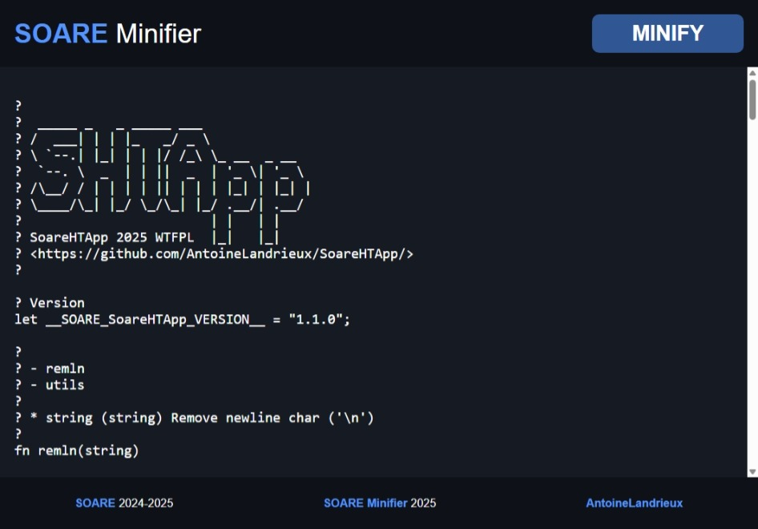

#  [SOARE](https://github.com/AntoineLandrieux/SOARE/) Minifier

>
> Minification involves compressing the source code of a SOARE file by removing unnecessary characters such as spaces, line breaks, indentations, and comments. This process reduces the file size so that it loads faster by the interpreter.
>



---

## Minify your code

**Example**:

```soare

? My program

let x = 0;

while x < 100 do

    write(x; '*'; x; '='; x * x);
    x = x + 1;

end;

```

**Result**:

```soare
let x=0;while x<100 do write(x;'*';x;'=';x*x);x=x+1;end;
```

## Contributing

The SOARE Minifier source code is located in the Git repository at [github.com/AntoineLandrieux/SoareMinifier](https://github.com/AntoineLandrieux/SoareMinifier/).
Contributions are most welcome by forking the repository and sending a pull request.

## Credit

See **[AUTHORS file](AUTHORS)**

**Contributors :**


